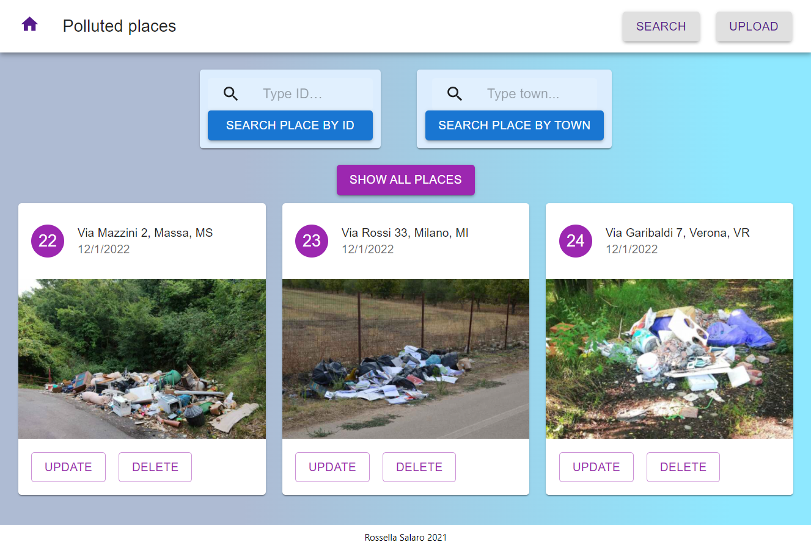

<p align="center">

  <h1 align="center">Polluted Places</h1>

  <h3 align="center">
     Keep track of the polluted places
  </h3>
</p>


<details open="open">
  <summary><h2 style="display: inline-block">Table of Contents</h2></summary>
  <ol>
    <li>
      <a href="#about-the-project">About The Project</a>
      <ul>
        <li><a href="#built-with">Built With</a></li>
      </ul>
    </li>
    <li>
      <a href="#getting-started">Getting Started</a>
      <ul>
        <li><a href="#prerequisites">Prerequisites</a></li>
        <li><a href="#installation">Installation</a></li>
      </ul>
    </li>
    <li><a href="#license">License</a></li>
    <li><a href="#contact">Contact</a></li>
    <li><a href="#acknowledgements">Acknowledgements</a></li>
  </ol>
</details>


## About The Project & usage


This front end project provides a user interface for the backend project [Polluted Places](https://github.com/srossella/polluted-places-api). It is built with React & Redux. 

It shows all the collections of polluted places (with address and photo) saved in the database and it is possible to view, update and delete each individual place, as well as add new places.  

To run a local copy please follow the steps below.

### Built With

* [ReactJS](https://reactjs.org/)
* [Axios](https://github.com/axios/axios)
* [Material-UI](https://material-ui.com/)
* [React Redux](https://react-redux.js.org/)

## Getting Started 

Before running the front end application, download and run the related backend project [here](https://github.com/srossella/polluted-places-api).

Then, follow the steps below. 


### Prerequisites
Install the latest version of `npm`

  ```sh
  npm install npm@latest -g
  ```

### Installation

1. Clone the repository

   ```sh
   git clone https://github.com/srossella/polluted-places-frontend.git
   ```

2. Install NPM packages

   ```sh
   npm install
   ```

3. Rename the file .env.example to .env in the root folder and insert your backend API port:

   ```sh
   REACT_APP_BACK_PORT= 'your backend port' 
   ```

4. Run development version 

   ```sh
   npm start
   ```


## License

Distributed under the MIT License. 

## Contact

Rossella Salaro - rossella.salaro@gmail.com

## Acknowledgements

* [Start2impact](http://start2impact.com/)